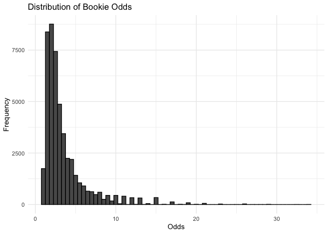

## Predicting Premier League Odds

### Using Machine Learning Models to Predict Premier League Betting Odds

#### Dinesh Rustagi

## Intro

For this project, I’ve decided to build a machine learning model to
predict the outcome of Premier League matches. The dataset I have chosen
is an aggregation of all Premier League matches from the 2000-2001
season to the 2020-2021 season. Throughout this project, I will be
employing several different models and assesing which one is the most
accurate for this binary classification problem.

### Loading Packages and Data

``` r
library(tidymodels)
library(ISLR)
library(ISLR2)
library(tidyverse)
library(glmnet)
library(modeldata)
library(ggthemes)
library(janitor)
library(naniar)
library(xgboost)
library(vip)
library(corrplot)
library(dplyr)
library(yardstick)
library(kknn)
library(glmnet)
library(themis)
library(ranger)
```

## Motive

Effectively harnessing the power of statistics has many benefits to our
daily lives. It helps us to make sense of the world around us and make
sound decisions when needed. Sports betting is highly dependant on these
same statistics, and betting companies employ them to a high degree in
order to formulate odds that will maximize their profits. However,
betting companies are only so accurate. Through the power of statistics,
we can use the same odds that the bookies use, on top of other prematch
data, to leverage more accurate odds than the bookies. Hopefully, this
will allow us to beat the bookies, and enjoy the fruits of applying
statistics.

## Data Description

For my data, I downloaded a data set called [“Football Results and
Betting Odds Data of
EPL”](https://www.kaggle.com/datasets/louischen7/football-results-and-betting-odds-data-of-epl),
made by Chen Lixi. The author didn’t include any attributions as to
where he got the data from, but it is clear he has aggregated multiple
datasets on the individual Premier League seasons between 2000 and 2021.
The dataset includes information pre-match, mid-match, and post-match
statistics, as well as the betting odds of 4 betting companies. It
appears that the author created some columns of his own as well, but
without documentation on how they should be interpreted, so we will drop
these columns.

``` r
results <- read_csv("final_dataset_with_odds.csv") %>%
  clean_names()
results = data.frame(results)
head(results)
```

    ##   x1    date  home_team  away_team fthg ftag ftr htgs atgs htgc atgc htp atp
    ## 1  0 8/17/02  Blackburn Sunderland    0    0  NH    0    0    0    0   0   0
    ## 2  1 8/17/02   Charlton    Chelsea    2    3  NH    0    0    0    0   0   0
    ## 3  2 8/17/02    Everton  Tottenham    2    2  NH    0    0    0    0   0   0
    ## 4  3 8/17/02     Fulham     Bolton    4    1   H    0    0    0    0   0   0
    ## 5  4 8/17/02      Leeds   Man City    3    0   H    0    0    0    0   0   0
    ## 6  5 8/17/02 Man United  West Brom    1    0   H    0    0    0    0   0   0
    ##   hm1 hm2 hm3 hm4 hm5 am1 am2 am3 am4 am5 home_team_lp away_team_lp mw
    ## 1   M   M   M   M   M   M   M   M   M   M           10           17  1
    ## 2   M   M   M   M   M   M   M   M   M   M           14            6  1
    ## 3   M   M   M   M   M   M   M   M   M   M           15            9  1
    ## 4   M   M   M   M   M   M   M   M   M   M           13           16  1
    ## 5   M   M   M   M   M   M   M   M   M   M            5           18  1
    ## 6   M   M   M   M   M   M   M   M   M   M            3           18  1
    ##   ht_form_pts_str at_form_pts_str ht_form_pts at_form_pts ht_win_streak3
    ## 1           MMMMM           MMMMM           0           0              0
    ## 2           MMMMM           MMMMM           0           0              0
    ## 3           MMMMM           MMMMM           0           0              0
    ## 4           MMMMM           MMMMM           0           0              0
    ## 5           MMMMM           MMMMM           0           0              0
    ## 6           MMMMM           MMMMM           0           0              0
    ##   ht_win_streak5 ht_loss_streak3 ht_loss_streak5 at_win_streak3 at_win_streak5
    ## 1              0               0               0              0              0
    ## 2              0               0               0              0              0
    ## 3              0               0               0              0              0
    ## 4              0               0               0              0              0
    ## 5              0               0               0              0              0
    ## 6              0               0               0              0              0
    ##   at_loss_streak3 at_loss_streak5 htgd atgd diff_pts diff_form_pts diff_lp
    ## 1               0               0    0    0        0             0      -7
    ## 2               0               0    0    0        0             0       8
    ## 3               0               0    0    0        0             0       6
    ## 4               0               0    0    0        0             0      -3
    ## 5               0               0    0    0        0             0     -13
    ## 6               0               0    0    0        0             0     -15
    ##   b365h b365d  b365a iwh iwd  iwa   lbh  lbd   lba  whh whd   wha
    ## 1 1.727  3.25  4.333 1.8 3.1  3.8 1.615 3.25  5.00 1.66 3.3  4.50
    ## 2 2.800  3.25  2.200 2.9 3.0  2.2 2.800 3.20  2.20 2.75 3.1  2.30
    ## 3 2.250  3.25  2.750 2.3 3.0  2.7 2.250 3.20  2.75 2.30 3.1  2.75
    ## 4 1.727  3.25  4.333 1.8 3.1  3.8 1.833 3.20  3.75 1.72 3.2  4.33
    ## 5 1.667  3.40  4.500 1.7 3.2  4.2 1.615 3.50  4.50 1.66 3.3  4.50
    ## 6 1.200  5.00 12.000 1.2 5.0 10.0 1.200 5.00 11.00 1.20 5.0 11.00

``` r
nrow(results)
```

    ## [1] 6000

## Data Tidying:

Let’s start by removing the columns that we have no interpretation for,
as well as mid-match, and post-match statistics. We will remove these
statistics because when we are making predictions, we will not have this
data available since predictions will be made before the match starts.
We will also remove columns that are essentially represented by other
columns in the dataset (e.g. ht_loss_streak5, ht_form_pts, etc) in order
to make room for predictors that we will add.

``` r
results_clean1 <- subset(results, select = -c(x1,ht_loss_streak5,at_loss_streak5,ht_win_streak5,at_win_streak5,ht_form_pts,at_form_pts,ftag,fthg,date,htgs,atgs,htgc,atgc,htp,atp,hm1,hm2,hm3,hm4,hm5,am1,am2,am3,am4,am5,home_team_lp,away_team_lp,mw,x1,ht_form_pts_str,at_form_pts_str))
```

Now, let’s modify the ftr column to be binary in order to make it easier
to interpret:

``` r
results_clean1 <- results_clean1 %>%
  mutate(ftr = ifelse(ftr == "H", 1, 0))
```

Here, let’s create serparate columns for each booking company to
indicate which team they favored:

``` r
results_clean1 <- results_clean1 %>%
  mutate(b365_pred = ifelse(b365h < b365d & b365h < b365a, 1, 0))
results_clean1 <- results_clean1 %>%
  mutate(iw_pred = ifelse(iwh < iwd & iwh < iwa, 1, 0))
results_clean1 <- results_clean1 %>%
  mutate(lb_pred = ifelse(lbh < lbd & lbh < lba, 1, 0))
results_clean1 <- results_clean1 %>%
  mutate(wh_pred = ifelse(whh < whd & whh < wha, 1, 0))
```

Now, lets create a column for each bookie indicating whether their
prediction was right or wrong:

``` r
results_clean1 <- results_clean1 %>%
  mutate(b365_acc = ifelse(ftr != b365_pred, 0, 1))
results_clean1 <- results_clean1 %>%
  mutate(iw_acc = ifelse(ftr != iw_pred, 0, 1))
results_clean1 <- results_clean1 %>%
  mutate(lb_acc = ifelse(ftr != lb_pred, 0, 1))
results_clean1 <- results_clean1 %>%
  mutate(wh_acc = ifelse(ftr != wh_pred, 0, 1))
```

Now, let’s finalize the dataset by moving the full-time result to the
back of the dataset for interpretability purposes, and by converting all
binary columns to factors:

``` r
df <- results_clean1[, c(setdiff(names(results_clean1), "ftr"), "ftr")]
df = df %>%
  mutate(ht_win_streak3 = factor(ht_win_streak3),ht_loss_streak3 = factor(ht_loss_streak3),at_win_streak3 = factor(at_win_streak3),at_loss_streak3 = factor(at_loss_streak3),b365_pred = factor(b365_pred),iw_pred = factor(iw_pred), lb_pred = factor(lb_pred), wh_pred = factor(wh_pred),b365_acc = factor(b365_acc),iw_acc = factor(iw_acc), lb_acc = factor(lb_acc), wh_acc = factor(wh_acc),ftr = factor(ftr))
head(df)
```

    ##    home_team  away_team ht_win_streak3 ht_loss_streak3 at_win_streak3
    ## 1  Blackburn Sunderland              0               0              0
    ## 2   Charlton    Chelsea              0               0              0
    ## 3    Everton  Tottenham              0               0              0
    ## 4     Fulham     Bolton              0               0              0
    ## 5      Leeds   Man City              0               0              0
    ## 6 Man United  West Brom              0               0              0
    ##   at_loss_streak3 htgd atgd diff_pts diff_form_pts diff_lp b365h b365d  b365a
    ## 1               0    0    0        0             0      -7 1.727  3.25  4.333
    ## 2               0    0    0        0             0       8 2.800  3.25  2.200
    ## 3               0    0    0        0             0       6 2.250  3.25  2.750
    ## 4               0    0    0        0             0      -3 1.727  3.25  4.333
    ## 5               0    0    0        0             0     -13 1.667  3.40  4.500
    ## 6               0    0    0        0             0     -15 1.200  5.00 12.000
    ##   iwh iwd  iwa   lbh  lbd   lba  whh whd   wha b365_pred iw_pred lb_pred
    ## 1 1.8 3.1  3.8 1.615 3.25  5.00 1.66 3.3  4.50         1       1       1
    ## 2 2.9 3.0  2.2 2.800 3.20  2.20 2.75 3.1  2.30         0       0       0
    ## 3 2.3 3.0  2.7 2.250 3.20  2.75 2.30 3.1  2.75         1       1       1
    ## 4 1.8 3.1  3.8 1.833 3.20  3.75 1.72 3.2  4.33         1       1       1
    ## 5 1.7 3.2  4.2 1.615 3.50  4.50 1.66 3.3  4.50         1       1       1
    ## 6 1.2 5.0 10.0 1.200 5.00 11.00 1.20 5.0 11.00         1       1       1
    ##   wh_pred b365_acc iw_acc lb_acc wh_acc ftr
    ## 1       1        0      0      0      0   0
    ## 2       0        1      1      1      1   0
    ## 3       1        0      0      0      0   0
    ## 4       1        1      1      1      1   1
    ## 5       1        1      1      1      1   1
    ## 6       1        1      1      1      1   1

Let’s check if there are any null values in our dataset:

``` r
na_sums <- data.frame(colSums(is.na(df)))
na_sums
```

    ##                 colSums.is.na.df..
    ## home_team                        0
    ## away_team                        0
    ## ht_win_streak3                   0
    ## ht_loss_streak3                  0
    ## at_win_streak3                   0
    ## at_loss_streak3                  0
    ## htgd                             0
    ## atgd                             0
    ## diff_pts                         0
    ## diff_form_pts                    0
    ## diff_lp                          0
    ## b365h                            0
    ## b365d                            0
    ## b365a                            0
    ## iwh                              0
    ## iwd                              0
    ## iwa                              0
    ## lbh                              0
    ## lbd                              0
    ## lba                              0
    ## whh                              0
    ## whd                              0
    ## wha                              0
    ## b365_pred                        0
    ## iw_pred                          0
    ## lb_pred                          0
    ## wh_pred                          0
    ## b365_acc                         0
    ## iw_acc                           0
    ## lb_acc                           0
    ## wh_acc                           0
    ## ftr                              0

Thankfully, there are no problematic null values to address in our
dataset and we can carry on.

## Exploratory Data Analysis:

In order to get a better idea of the relationship between the predictors
in the dataset, we will first take a look at a correlation plot:

``` r
predictor_vars <- c('htgd','atgd','diff_lp','diff_pts','diff_form_pts','b365h','iwh','lbh','whh')

# Calculate the correlation matrix
correlation_matrix <- corrplot(cor(df[predictor_vars]))
```


``` r
# Visualize the correlation matrix
print(correlation_matrix)
```

    ## $corr
    ##                      htgd        atgd    diff_lp   diff_pts diff_form_pts
    ## htgd           1.00000000 -0.01005249 -0.4527152  0.6597244     0.4880878
    ## atgd          -0.01005249  1.00000000  0.4614081 -0.6574622    -0.4776553
    ## diff_lp       -0.45271518  0.46140811  1.0000000 -0.6214443    -0.3851133
    ## diff_pts       0.65972437 -0.65746222 -0.6214443  1.0000000     0.7584056
    ## diff_form_pts  0.48808780 -0.47765529 -0.3851133  0.7584056     1.0000000
    ## b365h         -0.38348502  0.61871568  0.6669312 -0.6818363    -0.4367190
    ## iwh           -0.39933383  0.62953022  0.6885236 -0.7028186    -0.4482373
    ## lbh           -0.38599069  0.62501610  0.6755234 -0.6897083    -0.4462289
    ## whh           -0.38915407  0.62565729  0.6769121 -0.6912501    -0.4412504
    ##                    b365h        iwh        lbh        whh
    ## htgd          -0.3834850 -0.3993338 -0.3859907 -0.3891541
    ## atgd           0.6187157  0.6295302  0.6250161  0.6256573
    ## diff_lp        0.6669312  0.6885236  0.6755234  0.6769121
    ## diff_pts      -0.6818363 -0.7028186 -0.6897083 -0.6912501
    ## diff_form_pts -0.4367190 -0.4482373 -0.4462289 -0.4412504
    ## b365h          1.0000000  0.9810825  0.9835322  0.9880730
    ## iwh            0.9810825  1.0000000  0.9802020  0.9830310
    ## lbh            0.9835322  0.9802020  1.0000000  0.9871578
    ## whh            0.9880730  0.9830310  0.9871578  1.0000000
    ## 
    ## $corrPos
    ##            xName         yName x y        corr
    ## 1           htgd          htgd 1 9  1.00000000
    ## 2           htgd          atgd 1 8 -0.01005249
    ## 3           htgd       diff_lp 1 7 -0.45271518
    ## 4           htgd      diff_pts 1 6  0.65972437
    ## 5           htgd diff_form_pts 1 5  0.48808780
    ## 6           htgd         b365h 1 4 -0.38348502
    ## 7           htgd           iwh 1 3 -0.39933383
    ## 8           htgd           lbh 1 2 -0.38599069
    ## 9           htgd           whh 1 1 -0.38915407
    ## 10          atgd          htgd 2 9 -0.01005249
    ## 11          atgd          atgd 2 8  1.00000000
    ## 12          atgd       diff_lp 2 7  0.46140811
    ## 13          atgd      diff_pts 2 6 -0.65746222
    ## 14          atgd diff_form_pts 2 5 -0.47765529
    ## 15          atgd         b365h 2 4  0.61871568
    ## 16          atgd           iwh 2 3  0.62953022
    ## 17          atgd           lbh 2 2  0.62501610
    ## 18          atgd           whh 2 1  0.62565729
    ## 19       diff_lp          htgd 3 9 -0.45271518
    ## 20       diff_lp          atgd 3 8  0.46140811
    ## 21       diff_lp       diff_lp 3 7  1.00000000
    ## 22       diff_lp      diff_pts 3 6 -0.62144428
    ## 23       diff_lp diff_form_pts 3 5 -0.38511328
    ## 24       diff_lp         b365h 3 4  0.66693118
    ## 25       diff_lp           iwh 3 3  0.68852361
    ## 26       diff_lp           lbh 3 2  0.67552338
    ## 27       diff_lp           whh 3 1  0.67691206
    ## 28      diff_pts          htgd 4 9  0.65972437
    ## 29      diff_pts          atgd 4 8 -0.65746222
    ## 30      diff_pts       diff_lp 4 7 -0.62144428
    ## 31      diff_pts      diff_pts 4 6  1.00000000
    ## 32      diff_pts diff_form_pts 4 5  0.75840562
    ## 33      diff_pts         b365h 4 4 -0.68183630
    ## 34      diff_pts           iwh 4 3 -0.70281863
    ## 35      diff_pts           lbh 4 2 -0.68970826
    ## 36      diff_pts           whh 4 1 -0.69125007
    ## 37 diff_form_pts          htgd 5 9  0.48808780
    ## 38 diff_form_pts          atgd 5 8 -0.47765529
    ## 39 diff_form_pts       diff_lp 5 7 -0.38511328
    ## 40 diff_form_pts      diff_pts 5 6  0.75840562
    ## 41 diff_form_pts diff_form_pts 5 5  1.00000000
    ## 42 diff_form_pts         b365h 5 4 -0.43671896
    ## 43 diff_form_pts           iwh 5 3 -0.44823729
    ## 44 diff_form_pts           lbh 5 2 -0.44622886
    ## 45 diff_form_pts           whh 5 1 -0.44125042
    ## 46         b365h          htgd 6 9 -0.38348502
    ## 47         b365h          atgd 6 8  0.61871568
    ## 48         b365h       diff_lp 6 7  0.66693118
    ## 49         b365h      diff_pts 6 6 -0.68183630
    ## 50         b365h diff_form_pts 6 5 -0.43671896
    ## 51         b365h         b365h 6 4  1.00000000
    ## 52         b365h           iwh 6 3  0.98108249
    ## 53         b365h           lbh 6 2  0.98353224
    ## 54         b365h           whh 6 1  0.98807296
    ## 55           iwh          htgd 7 9 -0.39933383
    ## 56           iwh          atgd 7 8  0.62953022
    ## 57           iwh       diff_lp 7 7  0.68852361
    ## 58           iwh      diff_pts 7 6 -0.70281863
    ## 59           iwh diff_form_pts 7 5 -0.44823729
    ## 60           iwh         b365h 7 4  0.98108249
    ## 61           iwh           iwh 7 3  1.00000000
    ## 62           iwh           lbh 7 2  0.98020203
    ## 63           iwh           whh 7 1  0.98303099
    ## 64           lbh          htgd 8 9 -0.38599069
    ## 65           lbh          atgd 8 8  0.62501610
    ## 66           lbh       diff_lp 8 7  0.67552338
    ## 67           lbh      diff_pts 8 6 -0.68970826
    ## 68           lbh diff_form_pts 8 5 -0.44622886
    ## 69           lbh         b365h 8 4  0.98353224
    ## 70           lbh           iwh 8 3  0.98020203
    ## 71           lbh           lbh 8 2  1.00000000
    ## 72           lbh           whh 8 1  0.98715779
    ## 73           whh          htgd 9 9 -0.38915407
    ## 74           whh          atgd 9 8  0.62565729
    ## 75           whh       diff_lp 9 7  0.67691206
    ## 76           whh      diff_pts 9 6 -0.69125007
    ## 77           whh diff_form_pts 9 5 -0.44125042
    ## 78           whh         b365h 9 4  0.98807296
    ## 79           whh           iwh 9 3  0.98303099
    ## 80           whh           lbh 9 2  0.98715779
    ## 81           whh           whh 9 1  1.00000000
    ## 
    ## $arg
    ## $arg$type
    ## [1] "full"

Looking at the correlation plot, we can make a few conclusions. Goal
difference of the home and away teams and difference in standings points
are the main basis for the odds that the bookies generate. Now let’s
look at how the accuracy of the betting companies compare with
eachother:

``` r
bookmaker_accuracy <- data.frame(
  Bookmaker = c("b365", "iw", "lb", "wh"),
  Accuracy = c(round(mean(results_clean1$b365_acc),3), round(mean(results_clean1$iw_acc),3), round(mean(results_clean1$lb_acc),3), round(mean(results_clean1$wh_acc),3))
)

# Create a vertical bar chart with log scale on the y-axis
ggplot(bookmaker_accuracy, aes(x = Bookmaker, y = Accuracy)) +
  geom_bar(stat = "identity", fill = "blue") +
  labs(title = "Accuracy of Bookmakers", x = "Bookmaker", y = "Accuracy") +
geom_text(
    aes(label = Accuracy),
    position = position_stack(vjust = 1.05),  # Adjust vjust for vertical positioning
    color = "black",                           # Optional: set text color
    size = 4                                   # Optional: set text size
  )
```


Looks like the bookmakers are just as accurate as eachother, which
probably means they are using very similar algorithms to calculate their
odds. Now, let’s take try to gain some insight on the point difference
in the standings when the bookies were wrong:

``` r
concatenated_df <- df %>% select(ftr, diff_lp, b365_acc, iw_acc, lb_acc, wh_acc) %>%
  pivot_longer(cols = c(b365_acc, iw_acc, lb_acc, wh_acc), names_to = 'Bookmaker', values_to = 'Accuracy')

boxplot <- ggplot(concatenated_df, aes(x = factor(ftr), y = diff_lp, fill = factor(Accuracy))) +
  geom_boxplot() +
  labs(title = 'Box Plot of Bookmakers Accuracy Against Point Difference', x = 'Full-Time Result', y = 'Standings Point Difference', fill = 'Bookie Accuracy')
boxplot
```


In the box plot we can see that when the bookies lost, the point
differential was in favor of the team that lost, or the point
differential was around 0. This tracks logically because it is common
sense to place your bets on the team that is performing better in the
season, so it’s natural followed this logic. Also, when the point
differential is pretty close to 0 it’s not obvious who to bet on. This
is why they lost when there were contradictions to this logic. Now let’s
take a gander at the distribution of the odds:

``` r
bookies <- c('b365', 'iw', 'lb', 'wh')
# Initialize an empty dataframe to store the combined odds
combined_odds <- data.frame(odds = numeric(), type = character(), bookie = character())
# Loop through each bookie and concatenate the odds
for (bookie in bookies) {
  # Concatenate home odds
  home_odds <- df %>% select(matches(paste0('^', bookie, 'h$'))) %>% 
    gather(key = "bookie", value = "odds") %>% 
    mutate(type = 'Home')
  # Concatenate away odds
  away_odds <- df %>% select(matches(paste0('^', bookie, 'a$'))) %>% 
    gather(key = "bookie", value = "odds") %>% 
    mutate(type = 'Away')
  # Combine home and away odds
  bookie_odds <- rbind(home_odds, away_odds)
  # Add the bookie name to the 'bookie' column
  bookie_odds$bookie <- gsub('h$|a$', '', bookie_odds$bookie)
  # Bind the bookie odds to the combined odds dataframe
  combined_odds <- rbind(combined_odds, bookie_odds)
}
# Clean the bookie column to have only the bookie name
combined_odds$bookie <- gsub('\\d', '', combined_odds$bookie)
p <- ggplot(combined_odds, aes(x = odds)) + geom_histogram(binwidth = 0.5, color = 'black', position = 'identity') + labs(title = 'Distribution of Bookie Odds', x = 'Odds', y = 'Frequency') + theme_minimal()

# Print the histogram
print(p)
```



The odds are skewed right, and centered at about 3. We can see there are
some matches with very good odds (up to 26:1! I would bet on those
odds).

## Splitting the Data:

Before we split the data into testing and training sets, we will remove
columns ending with ’\_acc’ because these columns essentially give away
the full time result. We split the data in order to have data for the
model to test itself on data it hasn’t seen before, similar to a real
world situation. We can then observe its R-squared and treat that as the
model’s performance in the real world. We will also stratify the data on
the column ftr, because there may be differences in the predictors that
are important for the model to observe depending on the outcome of ftr.

``` r
set.seed(3435)
df_split <- initial_split(df %>% select(-b365_acc,-iw_acc, -lb_acc, -wh_acc), prop = 0.7, strata = 'ftr')
df_train <- training(df_split)
df_test <- testing(df_split)
dim(df_train)
```

    ## [1] 4199   28

Now, we will create folds for our data to enable us to perform v-fold
cross validation. Essentially, this allows us to provide the model with
multiple training sets that have new data each time, which is more
similar to a real world scenario resulting in higher model performance.
This also provides us with a better estimate of the model’s testing MSE
which is a measure of the model’s accuracy in the real world.

``` r
df_folds <- vfold_cv(data = df_train, v = 5, strata = 'ftr')
```

Here, we are setting up our recipe. We make sure to dummy code all of
our categorical predictors to ensure that they are read appropriately
and contribute to model training. We will also slightly manipulate our
numeric predictors by normalizing, centering, and scaleing all of our
numeric predictors in order to enhance model performance:

``` r
df_recipe = 
recipe(ftr ~ home_team+away_team+ht_win_streak3+ht_loss_streak3+at_win_streak3+at_loss_streak3+htgd+atgd+diff_pts+diff_form_pts+diff_lp+b365h+b365d+b365a+iwh+iwd+iwa+lbh+lba+lbd+whh+whd+wha+b365_pred+iw_pred+lb_pred+wh_pred,
         data = df_train) %>% 
  step_dummy(all_nominal_predictors()) %>%  # dummy predictor on categorical variables
  step_center(all_numeric_predictors()) %>% # standardizing our predictors
  step_normalize(all_numeric_predictors()) %>%
  step_scale(all_numeric_predictors())
```

Now we will set up our model workflows. We will be utilizing 4 different
machine learning models: K-nearest neighbors, logistic regression,
elastic-net, and random forest. In the process of setting up our
workflows we set certain hyperparameters for tuning. This allows us to
change the way the algorithms behave. We can then test many different
hyperparameter levels and chose the one that renders the best results:

``` r
knn_mod <- nearest_neighbor(neighbors = tune()) %>%
  set_mode("classification") %>%
  set_engine("kknn")
knn_wkflow <- workflow() %>% 
  add_model(knn_mod) %>% 
  add_recipe(df_recipe)
knn_grid = grid_regular(neighbors(range = c(1,20)),levels = 10)

log_reg = logistic_reg() %>%
    set_engine('glm') %>%
    set_mode("classification")
log_wkflow <- workflow() %>% 
  add_model(log_reg) %>% 
  add_recipe(df_recipe)

en_spec <- logistic_reg(mixture = tune(), 
                              penalty = tune()) %>%
  set_mode("classification") %>%
  set_engine("glmnet")
en_workflow <- workflow() %>% 
  add_recipe(df_recipe) %>% 
  add_model(en_spec)
en_grid <- grid_regular(penalty(range = c(-5, 5)),
                        mixture(range = c(0, 1)), levels = 10)

rf_class_spec <- rand_forest(mtry = tune(), 
                           trees = tune(), 
                           min_n = tune()) %>%
  set_engine("ranger", importance = 'impurity') %>% 
  set_mode("classification")

rf_class_wf <- workflow() %>% 
  add_model(rf_class_spec) %>% 
  add_recipe(df_recipe)

rf_grid <- grid_regular(mtry(range = c(1, 10)), 
                        trees(range = c(200, 600)),
                        min_n(range = c(10, 20)),
                        levels = 10)
```

Now that our workflows are ready, we can fit the models to the training
data:

``` r
log_fit <- fit_resamples(log_wkflow, df_folds)

res_en = readRDS('res_en.rds')
res_knn = readRDS('res_knn.rds')
res_rf = readRDS('res_rf.rds')
```

## Interpreting Training Results:

We will look at the ROC AUC to determine the accuracy of our models

### Logistic Regression

``` r
collect_metrics(log_fit)
```

    ## # A tibble: 2 × 6
    ##   .metric  .estimator  mean     n std_err .config             
    ##   <chr>    <chr>      <dbl> <int>   <dbl> <chr>               
    ## 1 accuracy binary     0.634     5 0.0102  Preprocessor1_Model1
    ## 2 roc_auc  binary     0.690     5 0.00879 Preprocessor1_Model1

We can see that our logistic regression model quite decent with an
roc_auc of 0.69 which is just about on par with the other models. This
is quite impressive considering logistic regression models are one of
the most straightforward and simple models, and it still wasn’t left
behind.

### K-Nearest Neighbors

``` r
autoplot(res_knn)
```


For our K-nearest neighbors model, there was one hyperparemeter that we
set to tune, which was the neighbors parameter. This has to do with the
amount of context that the algorithm looks at when classifying a data
point. As the neighbors hyperparameter increased, we saw better results.
The performance of the model peaked at 20 neighbors with an ROC of about
0.675.

### Elastic Net

``` r
autoplot(res_en)
```


Our elastic net model included two hyperparameters called penalty, and
mixture. In elastic net, the final model is actually comprised of two
separate models, and the mixture parameter determines how much of each
model goes into the final product. The penalty parameter reduces the
effect of the parameters, and can outright remove predictors from the
affecting the prediction. It appears that all mixture levels performed
relatively similarly and depending on the mixture, the amount of
regularization helped model performance for some time and then failed.
The elastic net appears to peak at an ROC of around 7.2.

### Random Forest

``` r
autoplot(res_rf ) +theme_minimal()
```


Our random forest model has 3 hyperparameters:mtry, trees, and
min_n. Mtry represents the amount of predictors that will be sampled
randomly during the creation of the models. Trees, represents the amount
of trees present in the random forest model. Finally, Min_n represents
the minimum amount of data values required to be in a tree node in order
for it to be split further down the tree. In our auto plot, it doesn’t
seem like the min_n has much of an effect on our outcome other than it
causes our results to be more varied as mtry increases. It seems the
factors that have the most impact in this case is trees and mtry. The
less predictor that are used the more accurate the model is, and the
model seems to perform the best with 422 trees.

## Model Selection

Now that we’ve gotten results from all of our models, find which tuning
parameters for each model result in the most accurate model and compare
to see which model we should move forward to the testing phase with:

``` r
best_knn <- show_best(res_knn, metric = "roc_auc")
best_knn = round(max(best_knn$mean),3)

best_en <- select_by_one_std_err(res_en,metric = "roc_auc", penalty,mixture)
best_en = round(best_en$mean,3)

log_reg_auc <- show_best(log_fit, metric = 'roc_auc')
log_reg_auc = round(log_reg_auc$mean,3)

rf_auc <- show_best(res_rf, metric = 'roc_auc')
rf_auc = round(max(rf_auc$mean),3)

roc_aucs <- c(best_knn,best_en,log_reg_auc,rf_auc)

model_names <- c("KNN",
            "Elastic Net",
            "Logistic Regression",
            "Random Forest")

roc_results <- tibble(Model = model_names,
                             ROC_AUC = roc_aucs)

roc_results <- roc_results %>% 
  arrange(roc_aucs)

roc_results
```

    ## # A tibble: 4 × 2
    ##   Model               ROC_AUC
    ##   <chr>                 <dbl>
    ## 1 KNN                   0.67 
    ## 2 Logistic Regression   0.69 
    ## 3 Elastic Net           0.711
    ## 4 Random Forest         0.718

``` r
ggplot(roc_results, aes(x = Model, y = ROC_AUC)) +
  geom_bar(stat = "identity", fill = "blue") +
  labs(title = "Which Model is Best?", x = "Model", y = "ROC")+
geom_text(
    aes(label = ROC_AUC),
    position = position_stack(vjust = 1.05),  # Adjust vjust for vertical positioning
    color = "black",                           # Optional: set text color
    size = 4                                   # Optional: set text size
  )
```


We can see the random forest model performs the best on the training
data. Now, lets finalize our workflow and test it on the testing data to
get an idea how the model would perform in the real world.

``` r
best_mod = show_best(res_rf, metric = "roc_auc")
best_mod = best_mod[1, ]
final_rf_model <- finalize_workflow(rf_class_wf, best_mod)
final_rf_model = fit(final_rf_model,df_train)
rf_model_test <- augment(final_rf_model, new_data = df_test, type = 'prob') 
roc_auc(rf_model_test %>% select(-.pred_class), ftr , .pred_0)
```

    ## # A tibble: 1 × 3
    ##   .metric .estimator .estimate
    ##   <chr>   <chr>          <dbl>
    ## 1 roc_auc binary         0.719

72%! That’s better than what we estimated from our training data! Let’s
graph the ROC curve so that we can visualize the accuracy of our model.

``` r
# Predict on the test set
rf_preds <- predict(final_rf_model, df_test) %>%
  bind_cols(df_test)

# Calculate accuracy
accuracy <- accuracy(rf_preds, truth = ftr, .pred_class)


print(paste("The model correctly predicts the full-time result", accuracy, "% of the time."))
```

    ## [1] "The model correctly predicts the full-time result accuracy % of the time."         
    ## [2] "The model correctly predicts the full-time result binary % of the time."           
    ## [3] "The model correctly predicts the full-time result 0.668517490283176 % of the time."

We can see that the model predicts the correct full time result about 6%
more of the time than the bookies. While this may seem small, this is
rather impressive considering we used elementary machine learning
concepts to create the model. Imagine how much better we can do if we
employed more advanced techniques!

``` r
rf_model_test_roc <- augment(final_rf_model, new_data = df_test, type = 'prob')  %>%
  roc_auc( ftr , .pred_0) %>%
  select(.estimate)
augment(final_rf_model, new_data = df_test, type = 'prob') %>%
  roc_curve(ftr, .pred_0) %>%
  autoplot()
```


Generally the best-looking ROC curves tend to follow the left and top
bound of the graph. Our ROC curve isn’t close to that, but it’s decent,
so it makes sense that we scored 72%.

## Conclusion

I was not surprised that a random forest model performed the best, but
what did suprise me was that the logistic regression model fit as well
as it did. I think, ultimately this means that the other models were
falling into the overfitting category since logistic regression is a
rather “stiff” model, and it being able to out perfom K-nearest
neighbors without any hyperparameters is not the most common thing. The
random forest also suprised me a bit in that the ROC curve didn’t follow
the conventonal pattern, however it proved to be harmless because the
random forest model ended up being the most accurate model. Other than
that I would say the other models performed as expected.

Going into this project, my goal was just to get my ROC to be greater
than the accuracy of the bookies however small that margin was. However,
the model fully exceeded my expectations and is about 11% more accurate
than the bookies. This is a pretty big statistical advantage, which can
help to put me at ease when I’m putting any amount of money down. I was
also surprised by how small the mtry was for the random forest model,
and how that was good enough for the model to be successful. Usually,
the model tends to get better the higher mtry is, so this was not a
conventional occurance. In hindsight, I believe the size of my dataset
helped tremendously in producing well fitted models, since it was so
big. The bookie data was also especially hepful in training the models
already because they already predict the results to a 61% acccuracy, so
the other predictors only helped to improve that.

I think if I were to do this project again I would’ve searched through
more datasets to find more relevant columns to add to this one. I think
a lot of the predictors while cool, could’ve been a bit more useful in
predicting the outcome. For example, I think it would an important
factor to consider if the home team was dealing with 7 injured players.
If I were to expand on this project I would probably set up api
implementation to continue to update the dataset with new Premier League
matches to ensure that the data stays accurate. In addition, maybe I
would also predict the actual odds of the match rather than just the
full time result, because for betters, the odds would provide further
insight on how to bet. I could also see a very similar project being
applied to other probability based activities such as poker, or
blackjack.

Through this project, I have really grown to understand the power of
machine learning and how its applications are incredibly useful in many
spheres of life. I think a lot of these models could essentially be a
replacement for the old magic 8 ball! I have found noticiing different
ways to apply this technology in ways that I had not before, and through
this class I’ve felt not only inspired by the course material, and
professor, but also by the students’ desire to push themselves to create
such unique and cool machine learning models. I also strongly appreciate
the open format of this class since it allows us to get involved with
topics we’re interested in.
